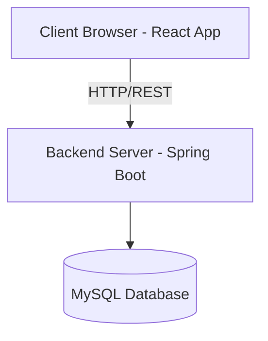
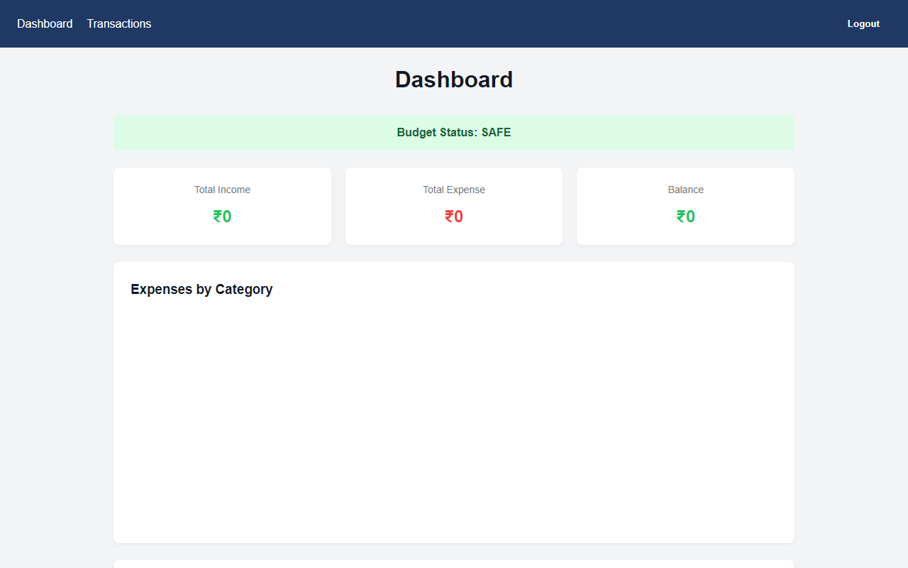
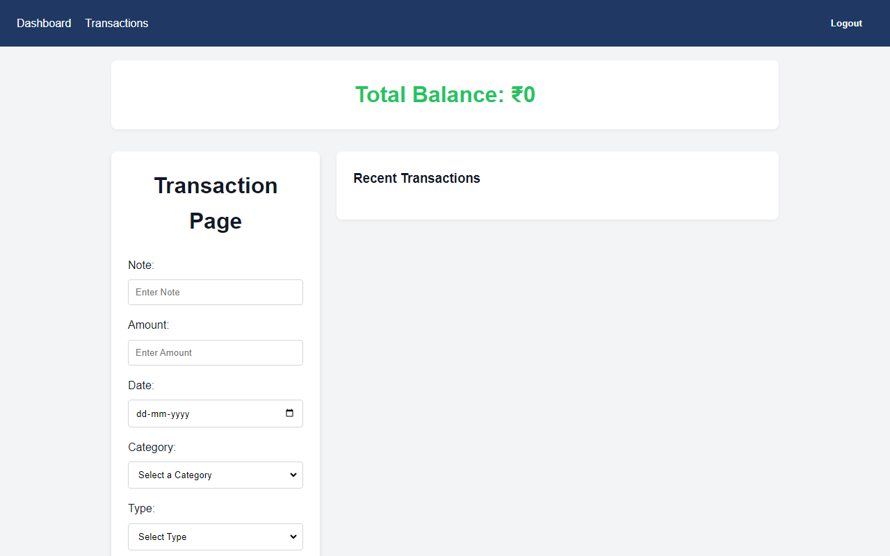
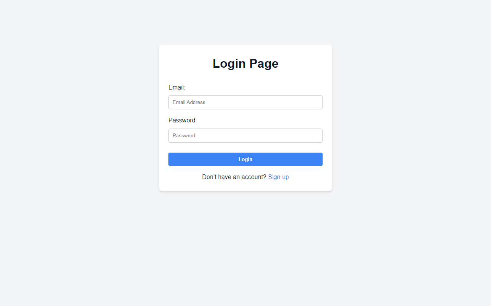
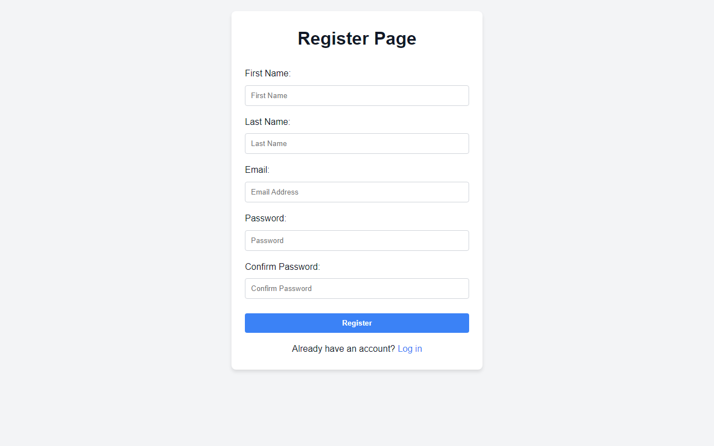

# Finance Tracker - Personal Finance Management Platform

A full-stack personal finance management application built with React (Vite) and Spring Boot, featuring user authentication, transaction management, monthly budgets, and expense visualization.

## Table of Contents

| Section | Description |
|---|---|
| [Features](#-features) | Transaction management, Budgeting, Dashboard |
| [Tech Stack](#-tech-stack) | React, Spring Boot, MySQL |
| [Architecture](#-architecture) | System design & Data flow diagrams |
| [Structure](#-project-structure) | Codebase organization & modules |
| [Getting Started](#-getting-started) | Setup guide for Backend & Frontend |
| [API Docs](#-api-documentation) | REST Endpoints & Usage |
| [Budget Logic](#-budget-logic) | Monthly budget tracking states |
| [Screenshots](#-screenshots) | App preview on Dashboard & Pages |
| [Contributing](#-contributing) | Guidelines for contributing |

## Features

### Core Functionality

- **User Authentication** - Register and login with JWT-based security
- **Transaction Management** - Add, edit, and delete income/expense transactions
- **Category System** - Pre-seeded categories (Salary, Food, Rent, Transport, etc.)
- **Dashboard** - Pie chart of expenses by category with income/expense/balance summary
- **Monthly Budget** - Set a monthly budget and track status (Safe / Warning / Danger)
- **Protected Routes** - Pages are accessible only to authenticated users
- **Auto Logout** - Automatically redirects to login on token expiry (401)

## Tech Stack

### Frontend

| Technology | Purpose |
|---|---|
| **React 18** | UI framework with hooks and context |
| **Vite** | Build tool and dev server |
| **React Router DOM** | Client-side routing |
| **CSS Modules** | Component-scoped styling |
| **Axios** | HTTP requests with JWT interceptor |
| **Recharts** | Pie chart visualization |

### Backend

| Technology | Purpose |
|---|---|
| **Spring Boot 3** | REST API framework |
| **Spring Security**| Authentication and authorization |
| **JWT (jjwt)** | Token generation and validation |
| **Spring Data JPA**| Database ORM |
| **MySQL** | Relational database |
| **Lombok** | Boilerplate reduction |

## Architecture

### System Architecture



### Frontend Architecture

```text
src/
├── api/
│   ├── authService.js        → Login, register endpoints
│   ├── transactionService.js → Transaction CRUD operations
│   ├── userService.js        → User details & budget operations
│   └── axiosInstance.js      → Axios with JWT interceptor
├── components/
│   ├── Navbar.jsx            → Top navigation bar
│   └── ProtectedRoute.jsx    → Route guard for authenticated users
├── pages/
│   ├── LoginPage.jsx         → User login form
│   ├── RegisterPage.jsx      → New user registration form
│   ├── DashboardPage.jsx     → Summary & pie chart visualization
│   └── TransactionPage.jsx   → Manage income/expense transactions
├── App.jsx                   → Root component with route definitions
├── App.css                   → Shared styles (buttons, cards, forms)
└── index.css                 → Global styles and CSS variables
```

### Backend Architecture

```text
src/main/java/com/backend/
├── config/
│   └── DataInitializer.java      → Seeds default categories on startup
├── controller/
│   ├── AuthController.java       → Authentication endpoints
│   ├── TransactionController.java→ Transaction management endpoints
│   ├── UserController.java       → User settings & budget endpoints
│   └── CategoryController.java   → Category retrieval endpoints
├── dto/
│   ├── LoginRequest.java         → Login payload
│   ├── LoginResponse.java        → Login response with JWT
│   ├── RegisterRequest.java      → Registration payload
│   └── SummaryResponse.java      → Dashboard summary data
├── entity/
│   ├── User.java                 → JPA entity for user accounts
│   ├── Transaction.java          → JPA entity for income/expense
│   └── Category.java             → JPA entity for transaction categories
├── repository/
│   ├── UserRepository.java       → JPA queries for users
│   ├── TransactionRepository.java→ JPA queries for transactions
│   └── CategoryRepository.java   → JPA queries for categories
├── security/
│   ├── CustomUserDetailsService.java → Loads user data for auth
│   ├── JwtFilter.java            → Intercepts requests for JWT validation
│   ├── JwtUtil.java              → JWT generation and parsing
│   └── SecurityConfig.java       → Security filter chain setup
└── service/
    ├── UserService.java          → User business logic
    └── TransactionService.java   → Transaction business logic
```

## Project Structure

```text
finance-tracker/
├── Frontend/                     # React application
│   └── src/
│       ├── api/                  # API service layer
│       ├── components/           # React components
│       ├── pages/                # Application pages
│       ├── App.jsx               # Root component & Routing
│       ├── App.css               # Shared styles
│       └── index.css             # Global styles
│
└── Backend/                              # Spring Boot application
    └── src/main/java/com/backend/
        ├── config/                       # Application configuration
        ├── controller/                   # REST controllers
        ├── dto/                          # Data Transfer Objects
        ├── entity/                       # Database entities
        ├── repository/                   # JPA repositories
        ├── security/                     # Security & JWT configuration
        └── service/                      # Business logic
```

## Getting Started

### Prerequisites

- Node.js 18+ and npm
- Java 17+
- MySQL 8+
- Maven

### Database Setup

1. Open MySQL and create the database:
   ```sql
   CREATE DATABASE finance_tracker;
   ```
2. Configure your credentials in `Backend/src/main/resources/application.properties`. Replace placeholders or use environment variables (`DB_PASSWORD`, `JWT_SECRET`):
   ```properties
   spring.datasource.url=jdbc:mysql://localhost:3306/finance_tracker
   spring.datasource.username=your_mysql_username
   spring.datasource.password=${DB_PASSWORD}
   jwt.secret=${JWT_SECRET}
   spring.jpa.hibernate.ddl-auto=update
   ```

### Backend Setup

1. Clone the repository and navigate to the backend directory:
   ```bash
   git clone https://github.com/TrinadhGorrela/finance-tracker.git
   cd finance-tracker/Backend
   ```
2. Run with Maven:
   ```bash
   ./mvnw spring-boot:run
   ```
   Backend runs on `http://localhost:8080`

### Frontend Setup

1. Navigate to frontend directory:
   ```bash
   cd ../Frontend
   ```
2. Install dependencies:
   ```bash
   npm install
   ```
3. Start dev server:
   ```bash
   npm run dev
   ```
   Frontend runs on `http://localhost:5173`

## API Documentation

### Authentication Endpoints

| Method | Endpoint | Access | Description |
|---|---|---|---|
| POST | `/api/auth/register` | Public | Register a new user |
| POST | `/api/auth/login` | Public | Login and receive JWT token |

### Transaction Endpoints

| Method | Endpoint | Access | Description |
|---|---|---|---|
| GET | `/api/transactions` | Protected | Get all transactions for logged-in user |
| GET | `/api/transactions?month=YYYY-MM` | Protected | Get transactions filtered by month |
| POST | `/api/transactions` | Protected | Create a new transaction |
| PUT | `/api/transactions/{id}` | Protected | Update an existing transaction |
| DELETE | `/api/transactions/{id}` | Protected | Delete a transaction (owner only) |
| GET | `/api/transactions/summary?yearMonth=YYYY-MM` | Protected | Get monthly income/expense summary and budget status |

### Category Endpoints

| Method | Endpoint | Access | Description |
|---|---|---|---|
| GET | `/api/categories` | Protected | Get all available categories |

### User Endpoints

| Method | Endpoint | Access | Description |
|---|---|---|---|
| GET | `/api/users/{userId}` | Protected | Get user details |
| PUT | `/api/users/{userId}` | Protected | Update monthly budget |

## Budget Logic

The `/api/transactions/summary` endpoint calculates a budget status for the current month:

| Status | Condition |
|---|---|
| `safe` | Expenses are below 80% of monthly budget |
| `warning` | Expenses are between 80% and 100% of monthly budget |
| `danger` | Expenses have exceeded the monthly budget |

*If no budget is set, the status defaults to `safe`.*

## Screenshots

### Dashboard
<p float="left">
  
</p>

### Transactions
<p float="left">
  
</p>

### Login & Register
<p float="left">
  
  
</p>

## Contributing

1. Fork the repository
2. Create a feature branch (`git checkout -b feature/amazing-feature`)
3. Commit changes (`git commit -m 'Add amazing feature'`)
4. Push to branch (`git push origin feature/amazing-feature`)
5. Open a Pull Request

## Author

**Siva Satya Trinadh Gorrela**

- **Email:** [trinadh.gorrela2004@gmail.com](mailto:trinadh.gorrela2004@gmail.com)
- **LinkedIn:** [Siva Satya Trinadh Gorrela](https://www.linkedin.com/in/trinadhgorrela/)
- **GitHub:** [@TrinadhGorrela](https://github.com/TrinadhGorrela)